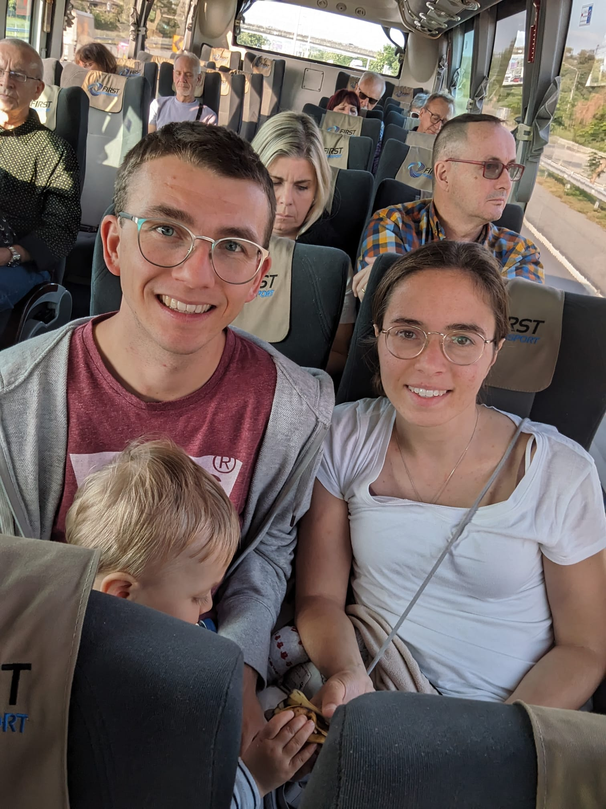

Hallo meine Lieblinge,

wenn ihr das lest, bin ich hoffentlich schon im Zug nach Hause! Dies ist daher die letzte Nachricht.

Ich freue mich wahnsinnig, bald wieder bei euch zu sein. Vermutlich schlaft ihr nachher schon, aber das ist ja egal! 

## Erinnerung 

Wisst ihr noch, wo wir an diesem Tag hingefahren sind? Das war ganz am Anfang unserer Asien-Kreuzfahrt, auf dem Weg nach Bangkok!

## Song für Mama

Ich liebe dich für immer und ewig! (... und noch viel länger ❤️)

<iframe width="300" height="169" src="https://www.youtube.com/embed/tR-qQcNT_fY?si=yLp9l_LdwJmcPQ74" title="YouTube video player" frameborder="0" allow="accelerometer; autoplay; clipboard-write; encrypted-media; gyroscope; picture-in-picture; web-share" referrerpolicy="strict-origin-when-cross-origin" allowfullscreen></iframe>

## Song für Edda

Kleine Eddamaus, für dich heißt es gleich: ab ins Bett!
Und was machen wir vorher?

<iframe width="300" height="169" src="https://www.youtube.com/embed/TaUKrv5hSOA?si=NPpLQtFerx0xPIqu" title="YouTube video player" frameborder="0" allow="accelerometer; autoplay; clipboard-write; encrypted-media; gyroscope; picture-in-picture; web-share" referrerpolicy="strict-origin-when-cross-origin" allowfullscreen></iframe>

***

Ich bin schon auf dem Weg zu euch - bald bin ich da! Ich kuschle mich dann dazu! ❤️

Bis später, Papabär 🐻
